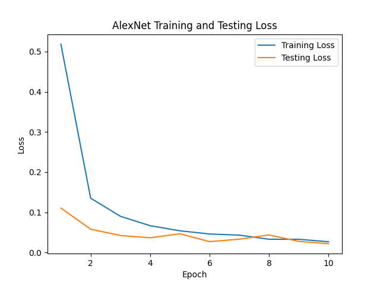

# Computer Vision History

## 1. LeNet-5 (1998)
- **Paper**: *LeCun et al., "Gradient-Based Learning Applied to Document Recognition"*
- **Impact**: Introduced CNNs, paving the way for modern deep learning applications in image processing.

## 2. SIFT (2004)
- **Paper**: *Lowe, "Distinctive Image Features from Scale-Invariant Keypoints"*
- **Impact**: Key algorithm for detecting and describing local features, widely used in object recognition and image matching.

## 3. AlexNet (2012)
- **Paper**: *Krizhevsky, Sutskever, Hinton, "ImageNet Classification with Deep Convolutional Neural Networks"*
- **Impact**: Sparked the deep learning revolution by winning ImageNet 2012, popularizing CNNs with GPU acceleration.

## 4. VGGNet (2014)
- **Paper**: *Simonyan, Zisserman, "Very Deep Convolutional Networks for Large-Scale Image Recognition"*
- **Impact**: Simplified deep networks by stacking 3x3 convolutions, influencing future architectures.

## 5. GAN (2014)
- **Paper**: *Goodfellow et al., "Generative Adversarial Nets"*
- **Impact**: Revolutionized generative modeling, enabling the creation of highly realistic images.

## 6. ResNet (2015)
- **Paper**: *He et al., "Deep Residual Learning for Image Recognition"*
- **Impact**: Solved the vanishing gradient problem with residual connections, enabling much deeper networks.

## 7. Faster R-CNN (2015)
- **Paper**: *Ren et al., "Faster R-CNN: Towards Real-Time Object Detection with Region Proposal Networks"*
- **Impact**: Improved real-time object detection by integrating region proposals into the detection pipeline.

## 8. YOLO (2016)
- **Paper**: *Redmon et al., "You Only Look Once: Unified, Real-Time Object Detection"*
- **Impact**: Introduced a fast, unified object detection model, enabling real-time detection applications.

## 9. UNet (2015)
- **Paper**: *Ronneberger et al., "U-Net: Convolutional Networks for Biomedical Image Segmentation"*
- **Impact**: Standardized medical image segmentation, becoming a go-to model for biomedical applications.

## 10. Neural Style Transfer (2015)
- **Paper**: *Gatys et al., "A Neural Algorithm of Artistic Style"*
- **Impact**: Enabled artistic image transformations by applying the style of one image to another using CNNs.

## 11. DeepLab (2017)
- **Paper**: *Chen et al., "Rethinking Atrous Convolution for Semantic Image Segmentation"*
- **Impact**: Introduced atrous convolutions and improved segmentation accuracy for dense prediction tasks.

## 12. Mask R-CNN (2017)
- **Paper**: *He et al., "Mask R-CNN"*
- **Impact**: Extended object detection to instance segmentation, providing both object bounding boxes and masks.

## 13. Vision Transformer (ViT) (2020)
- **Paper**: *Dosovitskiy et al., "An Image is Worth 16x16 Words: Transformers for Image Recognition at Scale"*
- **Impact**: Adapted transformers to vision tasks, achieving state-of-the-art performance without CNN inductive biases.

## 14. Swin Transformer (2021)
- **Paper**: *Liu et al., "Swin Transformer: Hierarchical Vision Transformer using Shifted Windows"*
- **Impact**: Introduced efficient, hierarchical transformers, becoming a top-performing model for detection and segmentation tasks.

## 15. ConvNeXt (2022)
- **Paper**: *Liu et al., "A ConvNet for the 2020s"*
- **Impact**: Modernized CNNs with transformer-inspired design improvements, proving that CNNs can still compete with transformers.

## 16. Pix2Seq v2 (2022)
- **Paper**: *Chen et al., "Pix2Seq v2: A Model for Object Detection via Image-to-Sequence Tasks"*
- **Impact**: Re-imagines object detection as a sequence generation problem, simplifying the detection pipeline while maintaining state-of-the-art performance.

## 17. Segment Anything Model (SAM) (2023)
- **Paper**: *Kirillov et al., "Segment Anything"*
- **Impact**: A foundation model for segmentation, capable of generalizing to various segmentation tasks without fine-tuning, pushing towards general-purpose vision models.

## 18. DINOv2 (2023)
- **Paper**: *Oquab et al., "DINOv2: Learning Robust Visual Features without Supervision"*
- **Impact**: Advances self-supervised learning, producing high-quality visual representations usable in various downstream tasks without labeled data.

## 19. BLIP-2 (2023)
- **Paper**: *Li et al., "BLIP-2: Bootstrapping Language-Image Pretraining with Frozen Image Encoders and Large Language Models"*
- **Impact**: Bridges vision and language models by combining frozen image encoders and large language models, excelling in tasks like visual question answering and captioning.

## 20. PaLI-X (2023)
- **Paper**: *Chen et al., "Scaling Language-Image Pre-training to 10 Billion Parameters"*
- **Impact**: Scales language-image models to 10 billion parameters, achieving state-of-the-art results in tasks such as image captioning and visual question answering.

## 21. EfficientViT (2023)
- **Paper**: *Zhang et al., "EfficientViT: Memory Efficient Vision Transformers for Mobile Devices"*
- **Impact**: Optimizes Vision Transformers for mobile and edge devices, reducing memory requirements while maintaining competitive performance.

## 22. MobileSAM (2023)
- **Paper**: *Li et al., "MobileSAM: Efficient Segment Anything"*
- **Impact**: Brings the capabilities of SAM to mobile environments, significantly improving efficiency for segmentation tasks on low-resource devices.
